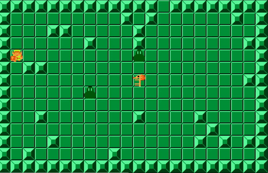
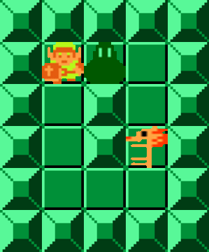
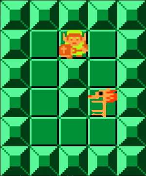
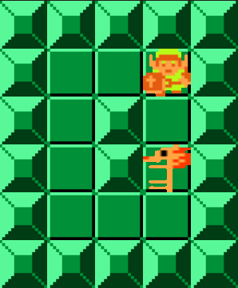
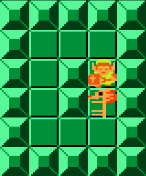
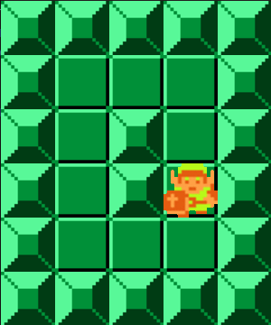
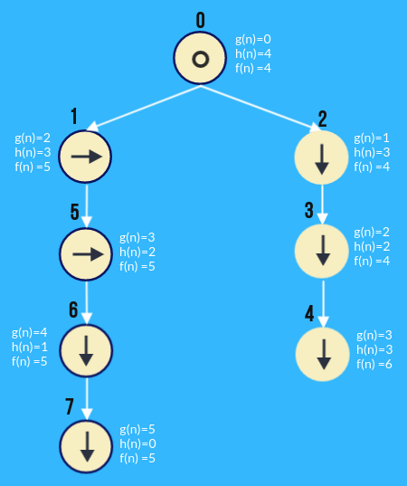

# Zelda maze with an implementation of A* search algorithm
This project was made for the introductory course to artificial intelligence 2019 at the Universidad del Valle, Colombia. Personally I find it interesting since it uses the NetworkX library to solve the problem.

Zelda maze is a simulation where the characters have an algorithm to play.
Link is in a dungeon where there is a key and two enemies, his mission is to go for the key and then reach the exit of the dungeon.
The A * search algorithm was used for Link and one enemy, the other enemy simply moves randomly.

## A* search algorithm
___
From article at [Wikipedia](https://en.wikipedia.org/wiki/A*_search_algorithm):
> A* (pronounced "A-star") is a graph traversal and path search algorithm, which is often used in many fields of computer science due to its completeness, optimality, and optimal efficiency. One major practical drawback is its  space complexity, as it stores all generated nodes in memory. Thus, in practical travel-routing systems, it is generally outperformed by algorithms which can pre-process the graph to attain better performance, as well as memory-bounded approaches; however, A* is still the best solution in many cases.

#### Description

A* is an informed search algorithm, or a best-first search, meaning that it is formulated in terms of weighted graphs: starting from a specific starting node of a graph, it aims to find a path to the given goal node having the smallest cost (least distance travelled, shortest time, etc.). It does this by maintaining a tree of paths originating at the start node and extending those paths one edge at a time until its termination criterion is satisfied.
At each iteration of its main loop, A* needs to determine which of its paths to extend. It does so based on the cost of the path and an estimate of the cost required to extend the path all the way to the goal. Specifically, A* selects the path that minimizes.

f(n)=g(n)+h(n)

where n is the next node on the path, g(n) is the cost of the path from the start node to n, and h(n) is a heuristic function that estimates the cost of the cheapest path from n to the goal. A* terminates when the path it chooses to extend is a path from start to goal or if there are no paths eligible to be extended. The heuristic function is problem-specific. If the heuristic function is admissible, meaning that it never overestimates the actual cost to get to the goal, A* is guaranteed to return a least-cost path from start to goal.

#### Implementation in the project

The decision tree is maded with [NetworkX](https://networkx.org/), a Python package for the creation, manipulation, and study of the structure, dynamics, and functions of complex networks.
Each node has the following information: Label, father, block, position, direction, g(n), h(n) and f(n).
In each iteration, the node with the smallest f(n) is expanded until the value of the heuristic h(n) is equal to 0, this node is de target.
In this case the cost g(h) to move is 1 and to pass through an enemy is 2 and the heuristic h(n) is the manhattan distance.
Then a journey backwards is made on the way to get from the target node to the node at level 1, this node has the direction to be taken.

## Example with 7 nodes

#### Node 0

#### Node 1

#### Node 5

#### Node 6

#### Node 7

#### Decision tree

Depending on the size of the board, the decision tree can have a large number of nodes, in this implementation the maximum is 10,000 for time reasons, but it can be adjusted as desired.